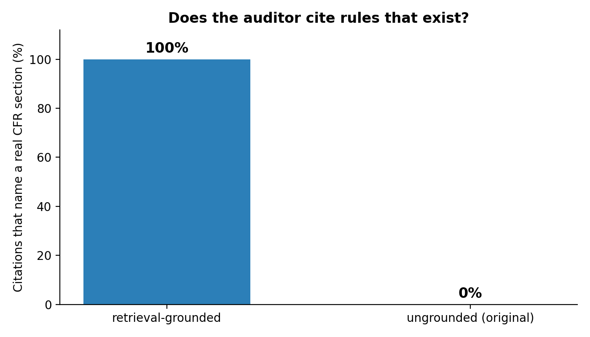

# Industrial Safety & Compliance Auditor

A locally hosted LLM audits a day of intermodal yard operations against federal safety regulations,
and the pipeline then checks whether the regulations it cites are real.

## The question

Getting a language model to flag an unsafe-looking yard event is easy. Getting it to name *which
rule* was broken, without inventing the section number, is not. For a compliance tool that
distinction is the whole product — the citation is what a safety manager acts on, and a confident,
correctly formatted, non-existent CFR reference is worse than no answer at all.

So this measures both: detection against a labelled log, and citation validity against the actual
text of federal law.

## Results

50 yard events, 9 planted violations, audited with `qwen3.5:9b` running locally under Ollama. Once
with retrieval grounding, once with the ungrounded prompt this project originally used.

| | retrieval-grounded | ungrounded |
| --- | --- | --- |
| Violations caught (of 9) | 3 | 1 |
| False positives | 4 | 0 |
| Precision | 0.43 | 1.00 |
| Recall | 0.33 | 0.11 |
| F1 | 0.38 | 0.20 |
| Accuracy | 0.80 | 0.84 |
| Citations given | 7 | 1 |
| Citations naming a real CFR section | 7 of 7 | 0 of 1 |



**Read these carefully, because the headline is not flattering.**

Retrieval tripled recall, from 0.11 to 0.33, and every one of the seven citations it produced names
a real section that was actually in the retrieved excerpts. The ungrounded run produced a single
citation and it was fabricated: `49 CFR 213.507 (or equivalent FRA hours-of-service rules)`. Part
213 is Track Safety Standards. Hours of service is Part 228.

But **the auditor is not good enough to use.** It misses two-thirds of the planted violations even
with grounding, and those violations are blunt — a 14-hour shift, a hydraulic leak in a marked
pedestrian crosswalk. Real yard data is subtler than this and the model would do worse, not better.
Ungrounded precision of 1.00 is not a strength either; it flagged one event in fifty, so it bought
perfect precision by almost never firing.

The citation comparison is directional, not conclusive. Seven citations against one is too thin a
denominator to claim a large effect, and honest reporting means saying so rather than printing
"100% vs 0%" and moving on. What it does establish is that the grounded configuration never invented
a section across seven attempts, while the ungrounded one invented the only section it offered — a
result consistent with the failure this rebuild was aimed at.

Citations were checked against **all 16,173 real section numbers in 29 and 49 CFR**, not just the 76
sections retrieved over here. Citing a genuine rule that sits outside the retrieved corpus is tracked
separately and is not counted as fabrication, since counting it that way would flatter retrieval.

### What would need to change to make this work

Recall is the problem, and it is probably not a model-size problem. The audit reads one event at a
time with top-k 4, so the retrieved excerpts are frequently about the wrong hazard — a query
mentioning a reach stacker pulls equipment rules even when the violation is the operator's shift
length. Deterministic pre-filters for the mechanical checks (shift hours are a threshold, not a
judgement call), retrieval per hazard category rather than per event, and a larger k are the obvious
next steps before reaching for a bigger model.

## How it works

1. **`code/fetch_regulations.py`** pulls the law a rail-served intermodal yard operates under from
   the eCFR API: 29 CFR 1910 subparts D (walking-working surfaces), N (materials handling and powered
   industrial trucks), S (electrical), and 49 CFR 228 (hours of service). 389 chunks across 76
   sections, each carrying its citation.
2. **`code/build_section_index.py`** indexes every real section in 29 and 49 CFR so a citation can be
   checked for existence rather than taken on trust.
3. **`code/generate_yard_log.py`** produces the labelled synthetic log — seeded and reproducible,
   with clean rows drawn from pools that cannot accidentally reproduce a hazard pattern.
4. **`code/audit_agent.py`** embeds each event, retrieves the top 4 regulation chunks by cosine
   similarity, and shows the model only those excerpts. Every citation returned is then verified.
   `--no-retrieval` reproduces the original ungrounded prompt for comparison.
5. **`main.ipynb`** presents the corpus, the ground truth, the retrieval, and the results.

## Running it

```bash
pip install -r requirements.txt
python code/fetch_regulations.py
python code/build_section_index.py
python code/generate_yard_log.py
python code/audit_agent.py                  # writes json/audit_results.json
python code/audit_agent.py --no-retrieval   # writes json/audit_results_ungrounded.json
```

The audit steps need [Ollama](https://ollama.com) with `mxbai-embed-large` and `qwen3.5:9b` pulled.
No data leaves the machine, which is the point for an operator who would not send yard logs to a
third-party API. The notebook reads the saved JSON, so it runs without Ollama.

The grounded run took roughly 50 minutes on CPU with no GPU; the ungrounded run, with a much shorter
prompt, took about 15.

## Ground truth

Nine violations across 50 events, evenly split across three categories, each mapping to a real rule:

| Violation | Condition | Rule |
| --- | --- | --- |
| fatigue | operator shift over 12 hours | 49 CFR 228 (hours of service) |
| spill | hazardous leak in a pedestrian zone | 29 CFR 1910.22 (housekeeping) |
| electrical | equipment inside a high-voltage zone | 29 CFR 1910.333 (clearances) |

`generate_yard_log.py` runs a label audit and refuses to write the file if any unlabelled row matches
a violation pattern. An earlier version of this dataset did not: five rows matched the spill pattern
while only one was labelled, and four matched the high-voltage pattern while only one was labelled,
which is enough to make precision and recall meaningless.

## Limitations

- **The log is synthetic**, and violations were planted by rule. Detection here is easier than on real
  yard data. These numbers are a floor on difficulty, not evidence of field performance.
- **50 events and 9 violations is a small sample.** One missed catch moves recall by 11 points. Treat
  every figure above as directional.
- **One model, one configuration** (`qwen3.5:9b`, top-k 4). No sweep over k, chunk size, or model, so
  nothing here claims this setup is optimal — and the poor recall suggests it is not.
- **Retrieval quality is not measured directly**, only observed through whether the model cited
  something real and on point.
- **The audit reads one event at a time.** Fatigue and equipment-defect patterns build across a shift,
  and a per-row prompt cannot see them.

## Tech

Python, Ollama (`qwen3.5:9b` for reasoning, `mxbai-embed-large` for embeddings), NumPy for similarity
search, pandas, matplotlib. No cloud services and no vector database — 389 chunks is small enough
that a normalised dot product over a NumPy array is the right tool.
