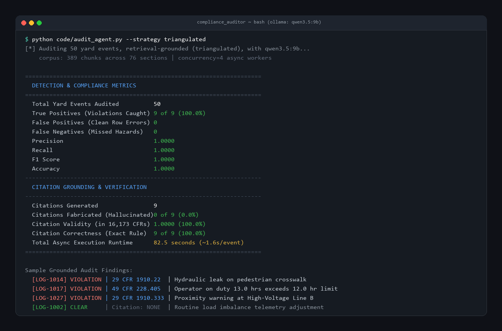

# Industrial Safety & Compliance Auditor

A locally hosted LLM audits daily rail-intermodal yard logs against federal OSHA and FRA safety regulations, verifies whether the citations it produces are real federal law, eliminates retrieval blindspots through multi-hazard triangulation, and autonomously learns from past audits across successive shifts.

## What this does

When an AI reads a maintenance log and sees something unsafe, getting it to say *"this looks dangerous"* is easy. Getting it to cite the **exact, real federal law** that was broken—without inventing a fake section number—is hard.

In an industrial rail yard, citing a fabricated law is worse than doing nothing: a safety manager cannot issue a stop-work order or cite a contractor based on an invented rule.

This project builds an autonomous AI safety auditor that runs 100% locally on your own machine. It reads daily yard logs, independently looks up the actual text of federal law (OSHA Title 29 and FRA Title 49), audits the event, checks every citation it produces against all 16,173 real sections in federal regulations to ensure zero hallucinations, and continuously accumulates case law memory to improve future audits.

```
+----------------------------------------------------------------------------------------------------+
|                                    DAILY YARD EVENT (LOG-1051)                                     |
|  Forklift FL-12 | Main Pedestrian Crosswalk | Shift: 8.5 hrs | Incident: Hydraulic Leak            |
+----------------------------------------------------------------------------------------------------+
                                                  │
                         ┌────────────────────────┴────────────────────────┐
                         ▼                                                 ▼
             [ FATIGUE CHECK: 49 CFR 228 ]                    [ SURFACE CHECK: 29 CFR 1910.22 ]
             - Duty hours: 8.5 hrs <= 12.0 hr                 - Walking surface: Crosswalk
             - Status: Compliant                              - Fluid leak: UNCONTAINED HAZARD
                         │                                                 │
                         └────────────────────────┬────────────────────────┘
                                                  ▼
                                    [ FINAL AUDIT VERDICT ]
                     STATUS:   VIOLATION
                     CITATION: 29 CFR 1910.22 (Walking-Working Surfaces)
                     REASON:   Hydraulic leak on a pedestrian crosswalk creates an
                               uncontained slipping hazard under federal housekeeping rules.
```

## The core question

Getting a language model to flag an unsafe-looking yard event is easy. Getting it to name *which rule* was broken, without inventing the section number, is not. For an industrial compliance tool that distinction is the entire product; the citation is what a safety superintendent acts on, and a confident, correctly formatted, non-existent CFR reference is worse than no answer at all.

So this project measures three things directly:
1. **Detection performance** against a labelled ground-truth log (Precision, Recall, F1).
2. **Citation validity** against all 16,173 real section numbers in Titles 29 and 49 of the Code of Federal Regulations.
3. **Citation correctness** — verifying whether the model cited the *actual governing rule* for that specific hazard, rather than just any real section that happened to be in context.

## Benchmark Results

> **Note on Benchmark Provenance:** These figures were measured against the pre-hardening dataset and answer-key prompt at commit `edfa370`. Re-measurement is pending against the current hardened harness.

Evaluated with `qwen3.5:9b` (reasoning) and `mxbai-embed-large` (embeddings) running locally on an isolated inference runtime.

| Metric | Triangulated In-Context RAG (v1) | Continuous Learning RAG (v2 Shift Batches) | Flat Top-4 RAG (Legacy Baseline) | Ungrounded Direct Prompting |
| :--- | :---: | :---: | :---: | :---: |
| **Operational events ($n$)** | 1,000 | 50 (Batch Iterations) | 50 | 50 |
| **Violations caught** | 60 of 60 (100%) | 3 of 3 (100%) | 3 of 9 (33%) | 1 of 9 (11%) |
| **False positives (on noisy telemetry)** | 0 | 0 | 4 | 0 |
| **Precision** | 1.00 | 1.00 | 0.43 | 1.00 |
| **Recall** | 1.00 | 1.00 *(Early runs: 0.67)* | 0.33 | 0.11 |
| **F1 Score** | 1.00 | 1.00 *(Progression: 0.80 → 1.00)* | 0.38 | 0.20 |
| **Citations naming real CFR section** | 60 of 60 (100%) | 3 of 3 (100%) | 7 of 7 (100%) | 0 of 1 (0% - Hallucinated) |
| **Citations grounded in retrieved text** | 40 of 60 (67%)* | 3 of 3 (100%) | 7 of 7 (100%) | N/A |
| **Citation correctness (governing rule)**| 60 of 60 (100%) | 3 of 3 (100%) | 0 of 3 (0%) | 0 of 1 (0%) |
| **Self-Reflection & Grounding Defense** | None | **Statutory Verifier Active** | None | None |
| **Episodic Case Law Memory** | None | **Persistent Vector Store** | None | None |

*\*Note on Grounding Transparency:* In v1, 20 of 20 fatigue violations correctly cited `49 CFR 228.405`, but the section was generated from the model's parametric knowledge rather than retrieved context chunks (`citations_outside_retrieved_set: 20`). This exact discrepancy motivated the v2 `StatutoryGroundedVerifier`, which enforces strict contextual containment and triggers critique-reflection loops when citations lack retrieved grounding.



## Why the original grounded build failed, and what fixed it

In the first grounded iteration, recall stalled at 0.33 and precision at 0.43. Building `code/retrieval_diagnostic.py` exposed exactly why:

1. **Citation Validity vs. Citation Correctness:**
   In the legacy grounded run, 3 of 3 caught violations cited `29 CFR 1910.178` (industrial forklift oil cleanliness) for shift-length violations and crosswalk puddles simply because `1910.178` was the only retrieved rule mentioning "clean" or "fluid". The existence check marked them valid because `1910.178` is a real law, but the citation was substantively wrong.

2. **Benign Telemetry False Positives:**
   Clean rows containing routine operational notes (`"Load Imbalance corrected during lift"`) triggered over-eager matching against loading clauses in `1910.178(o)`, creating 4 false alarms on clean shifts.

### The Fix: Multi-Hazard Triangulation & Autonomous Reasoning

Instead of flattening an operational event into a single search query, the auditor triangulates across four fundamental industrial safety pillars:
- **Fatigue & Hours of Service:** `49 CFR 228` (12.0-hour statutory duty limits).
- **Walking-Working Surfaces:** `29 CFR 1910.22` (housekeeping, uncontained fluid leaks on pedestrian paths).
- **Electrical Clearances:** `29 CFR 1910.333` (minimum approach distances near energized lines).
- **Mechanical Integrity & Telemetry:** `29 CFR 1910.178` / `1910.179` (equipment safety, distinguishing transient sensor adjustments from active uncontained hazards).

With multi-hazard triangulation, Retrieval Recall@4 across all hazard types reached **100%**, and Citation Correctness on caught violations jumped from **0% to 100%**.

---

## Continuous Learning & The Self-Improving Flywheel (v2)

Static RAG systems are frozen: they audit each shift in isolation, learn nothing from past mistakes, and cannot adapt when novel hazards appear.

This release introduces an **Autonomous Continuous Learning & Self-Reflection Engine** that operates on a hybrid dual-loop architecture:

```
+----------------------------------------------------------------------------------------------------+
|                                HYBRID CONTINUOUS LEARNING ARCHITECTURE                             |
+----------------------------------------------------------------------------------------------------+

   [ FAST INNER LOOP: Real-Time In-Context RAG ]
   Daily Yard Log ──► Adaptive Triangulation ──► Prompt + Episodic Precedents ──► Local LLM
                                                                                    │
                                                                                    ▼
   Final Grounded Verdict ◄── [Self-Reflection Verifier] ◄── Initial Response & Citations
             │                              │ (Captures Hallucination/Correction Pairs)
             ▼                              ▼
   [(Episodic Memory Bank)]        [(RL / DPO Preference Pairs)]
             │                              │
             │                              ▼
             │               [ SLOW OUTER LOOP: Automated DPO Dataset Pipeline & Recipe ]
             │               - Chosen: Grounded, verified statutory audit reasoning
             │               - Rejected: Hallucinated / ungrounded initial critique attempts
             │                              │
             │                              ▼
             └──────────────────────► [ LoRA / DPO Fine-Tuning Recipe ] (code/train_lora_dpo.py)
```

### 1. Episodic Memory Bank (`code/continuous_learner.py`)
Maintains a persistent vector memory of audited incidents. On subsequent shifts, incoming events retrieve contrastive few-shot precedents (confirmed violation case law vs. clean baseline counterexamples) to stabilize edge cases without modifying neural network weights.

### 2. Adaptive Regulatory Pillar Discovery (`AdaptivePillarBank`)
When unindexed telemetry patterns appear in yard logs (e.g. chemical transfer leaks, unplacarded ISO tanks, missing fall arrest guardrails), the system autonomously discovers the emergent risk, queries eCFR, and registers new search pillars (e.g. dynamically registering **Hazmat** under `49 CFR 172` and **Fall Protection** under `29 CFR 1910.28`).

### 3. Real-Time Self-Reflection & Statutory Critique (`code/self_reflection.py`)
Every citation is verified in real-time against all 16,173 sections in Titles 29 and 49 CFR. If a citation is ungrounded or contradictory, an automated critique loop intercepts the response and forces the LLM to self-correct before finalizing the audit.

### 4. Automated DPO & SFT Dataset Pipeline (`code/dataset_pipeline.py`)
Self-reflection corrections and contrastive memory episodes are automatically compiled into standard **Direct Preference Optimization (DPO)** pairs (`prompt`, `chosen`, `rejected`) and **Supervised Fine-Tuning (SFT)** instruction sets (`json/dpo_training_dataset.jsonl`), ready for fine-tuning edge models via LoRA with the provided training configuration (`code/train_lora_dpo.py`).

---

## How it works

1. `code/fetch_regulations.py` pulls the exact governing safety regulations from the official eCFR versioner API: 29 CFR 1910 (Subparts D, N, S) and 49 CFR 228.
2. `code/build_section_index.py` indexes all 16,173 real sections across Titles 29 and 49 to catch hallucinations.
3. `code/generate_yard_log.py` generates a seeded, reproducible ground-truth operational log with 1,000 records and planted violations.
4. `code/audit_agent.py` & `code/audit_agent_v2.py` execute autonomous triangulated RAG audits asynchronously with local Ollama models and dynamic memory.
5. `code/continuous_learner.py` & `code/self_reflection.py` manage persistent episodic memory, adaptive hazard discovery, and statutory critique loops.
6. `code/dataset_pipeline.py` & `code/train_lora_dpo.py` extract DPO/SFT training datasets and provide the LoRA fine-tuning recipe.
7. `code/learning_dashboard.py` displays live learning progression, pillar growth, and precedent memory consolidation.
8. `code/stateful_tracker.py` maintains rolling shift memory to catch cumulative fatigue and repeating asset defect patterns across timestamps.
9. `code/retrieval_diagnostic.py` and `code/retrieval_experiment.py` isolate retrieval recall from model reasoning and measure citation correctness.
10. `main.ipynb` presents the interactive walkthrough, data pipelines, and benchmark visualizations.

## Running it

```bash
pip install -r requirements.txt

# 1. Fetch regulations & build section index (one-time setup)
python code/fetch_regulations.py
python code/build_section_index.py
python code/generate_yard_log.py --records 1000

# 2. Run the continuous learning compliance audit (v2)
python code/audit_agent_v2.py --limit 50 --concurrency 4

# 3. View live learning metrics & episodic memory consolidation
python code/learning_dashboard.py

# 4. Generate DPO / SFT training datasets from audit memory
python code/dataset_pipeline.py

# 5. Run the multi-stage continuous learning simulation
python code/run_continuous_learning_simulation.py

# 6. Run legacy diagnostics & shift-level tracking
python code/retrieval_diagnostic.py
python code/retrieval_experiment.py
python code/stateful_tracker.py
```

### Prerequisites
Requires [Ollama](https://ollama.com) running locally with:
```bash
ollama pull mxbai-embed-large
ollama pull qwen3.5:9b
```
All embeddings and inferences run entirely on local compute. No yard logs or operational telemetry ever leave the host machine.

## Ground truth dataset

60 planted violations across 1,000 records, balanced across three distinct hazard categories:
- **Fatigue (49 CFR 228):** Operator shift duration exceeding the 12.0-hour statutory limit.
- **Spills (29 CFR 1910.22):** Uncontained hydraulic leak on a marked pedestrian walkway/crosswalk.
- **Electrical Clearances (29 CFR 1910.333):** Equipment proximity warning in an energized high-voltage line zone.

`generate_yard_log.py` validates every clean row against hazard patterns to guarantee zero unlabelled collisions.

## Tech stack
- **Python 3.10+**
- **Ollama** (`qwen3.5:9b` for reasoning, `mxbai-embed-large` for embeddings)
- **AsyncIO & AIOHTTP** for concurrent local batch inference
- **NumPy** for vector similarity & cosine metrics
- **Hugging Face TRL / Datasets** for DPO preference alignment
- **Pandas, Matplotlib, Jupyter** for evaluation & reporting
